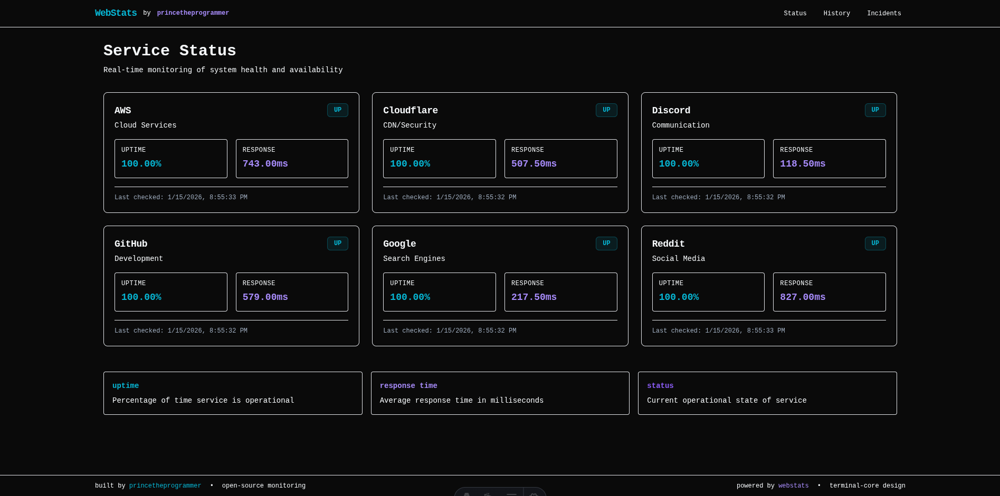
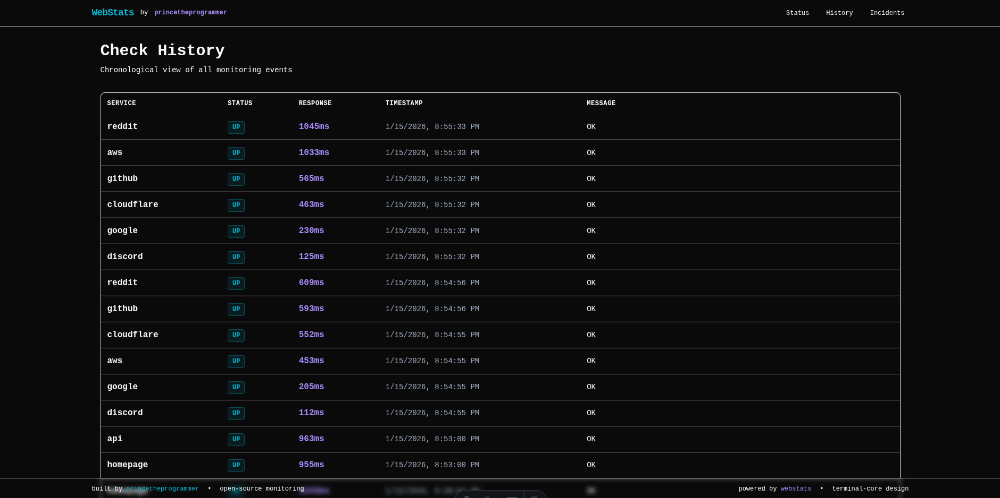
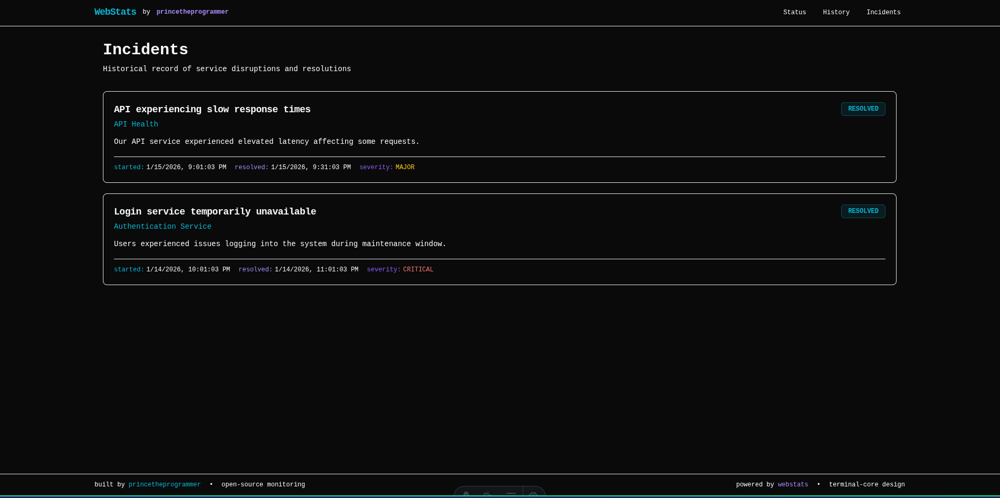

# WebStats

Open-source uptime monitoring on GitHub Actions + Pages. Inspired by Upptime but with modern UI and enhanced features.

<p align="center">
  
</p>

## Features

- 🚀 **Free hosting** on GitHub Pages
- ⏱️ **Frequent monitoring** (every 5 minutes via GitHub Actions)
- 🎨 **Terminal-core UI** with dark theme designed for developers
- 🌐 **Custom domain support** (subdomain or apex domain)
- 📊 **Real-time stats** with uptime percentage and response times
- 🔔 **Incident tracking** with GitHub Issues integration
- 📈 **Historical data** with NDJSON storage format
- 🛠 **Easy setup** with template repository
- 💻 **Maintained by princetheprogrammer** - Built for developers, by developers

<p align="center">
  
</p>

## Quick Start

### 1. Use this template

Click **"Use this template"** to create your own repository based on WebStats.

### 2. Configure your services

Edit `monitor.config.yml` to add your services to monitor:

```yaml
services:
  - id: google
    name: "Google"
    url: "https://www.google.com"
    group: "Search Engines"
    method: "GET"
    assertions:
      status: [200]

  - id: discord
    name: "Discord"
    url: "https://discord.com"
    group: "Communication"
    method: "GET"
    assertions:
      status: [200]

  - id: cloudflare
    name: "Cloudflare"
    url: "https://www.cloudflare.com"
    group: "CDN/Security"
    method: "GET"
    assertions:
      status: [200]
```

### 3. Enable GitHub Actions

Make sure GitHub Actions are enabled in your repository settings:
- Go to **Settings** → **Actions** → **General**
- Under "Workflow permissions", select **"Allow all actions and reusable workflows"**

### 4. Configure GitHub Pages

- Go to **Settings** → **Pages**
- Under "Source", select **GitHub Actions**
- Save the settings

### 5. Customize site settings (optional)

Update the site configuration in `monitor.config.yml`:

```yaml
site:
  name: "My Service Status"
  description: "Status page for my services"
  baseUrl: "https://myusername.github.io/my-repo-name"
  customDomain: ""  # Leave empty for default, or set to "status.mycompany.com"
  theme:
    accent: "#06b6d4"  # Electric cyan accent from terminal-core palette
    logo: "/logo.svg"  # Path to your logo
```

## Maintenance & Updates

Built and maintained by **princetheprogrammer**, this system is designed for easy maintenance:

### CI/CD Workflows (Fully Automated)
- **Monitor Workflow**: Runs every 5 minutes to check services
- **Deploy Workflow**: Automatically rebuilds and deploys site when data changes
- **Cleanup Workflow**: Weekly data compaction to prevent repository bloat

### Easy Updates
- **Single Config File**: All settings in `monitor.config.yml`
- **Zero Downtime**: GitHub Actions handle all deployments seamlessly
- **Version Control**: All changes tracked in git history
- **Rollback Ready**: Easy to revert to previous configurations

### Monitoring & Runners
- **Self-Contained**: Runs entirely on GitHub infrastructure
- **No Servers**: No VPS or cloud instances needed
- **Scalable**: Add/remove services without changing infrastructure
- **Reliable**: GitHub Actions has 99.9% uptime SLA

## Custom Domain Setup

If you want to use a custom domain like `status.yourdomain.com`:

### 1. DNS Configuration

Add a CNAME record to your DNS provider:

- Type: `CNAME`
- Name/Host: `status` (or your subdomain)
- Value: `yourusername.github.io`

### 2. GitHub Pages Configuration

- Go to **Settings** → **Pages**
- Set "Custom domain" to your domain (e.g., `status.yourdomain.com`)
- Check "Enforce HTTPS"
- Save settings

### 3. Update Configuration

In `monitor.config.yml`:

```yaml
site:
  baseUrl: "https://status.yourdomain.com"
  customDomain: "status.yourdomain.com"
```

## Documentation

For comprehensive documentation, see the [docs/](./docs/) directory:

- [Overview](./docs/overview.md) - Detailed system overview
- [Architecture](./docs/architecture/) - High and low-level design
- [Development](./docs/development/) - Setup and contribution guides
- [Future Roadmap](./docs/future/roadmap.md) - Planned features and enhancements
- [Contributing](./CONTRIBUTING.md) - How to contribute to the project

<p align="center">
  
</p>

## How it works

1. **Monitoring**: GitHub Actions runs every 5 minutes to check your services
2. **Storage**: Results are stored in the `data/` directory as NDJSON files
3. **Incidents**: Downtime creates GitHub Issues automatically
4. **Website**: Static site is rebuilt and deployed to GitHub Pages
5. **History**: All data is preserved for historical analysis

## Local Development

```bash
# Install dependencies
pnpm install

# Run both site and monitor locally
pnpm dev

# Build the site
pnpm build
```

## Architecture

- **Runner**: TypeScript app that performs HTTP checks and stores results
- **Site**: Astro-based static site with terminal-core design
- **Data**: NDJSON files for efficient storage and querying
- **CI/CD**: GitHub Actions workflows for monitoring and deployment
- **Maintenance**: Designed by princetheprogrammer for minimal upkeep

## Contributing

We welcome contributions! Please read our [Contributing Guidelines](./CONTRIBUTING.md) for details on how to participate in this project.

## License

This project is licensed under the MIT License - see the [LICENSE](./LICENSE.md) file for details.

## About the Developer

Built with ❤️ by **princetheprogrammer** - A developer-focused solution for reliable uptime monitoring with zero infrastructure costs.

## Future Plans

Check out our [Roadmap](./docs/future/roadmap.md) to see upcoming features and enhancements.